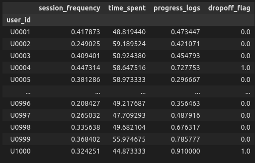

# Dropout Risk Prediction Report

**Author:** Zaynap Ahmad
**Date:** August 3, 2025
**Track:** Machine Learning
**Task:** Train a model that predicts dropout risk based on session frequency, time spent, and progress logs. Visualize results and provide key takeaways.

---

## 1. **Dataset Selection and Justification**

I used the dataset provided in the data analysis task as the foundation for this modeling exercise.

### Why this dataset was used:

* It already contains rich behavioral and demographic indicators.
* It includes the dropout label.
* It's session-level, allowing us to engineer user-level behavioral trends.

---

## 2. **Feature Engineering**

Since the task was to predict dropout based on **session frequency**, **time spent**, and **progress logs**, I engineered the following features per user:

* **Session Frequency:** Average number of sessions per day since signup.
* **Time Spent:** Average session duration in minutes.
* **Progress Logs:** Check-in rate (percentage of sessions where goals were marked as completed).

These features were aggregated on a per-user basis using `.groupby('user_id')`, so the prediction is at the **user level**, not session level.



---

## 3. **Target Imbalance Analysis**

Dropout (`dropoff_flag`) was highly imbalanced:

* **Dropouts (1):** ~6%
* **Non-dropouts (0):** ~94%

This would bias the model toward always predicting "stay". To handle that, I applied **SMOTE (Synthetic Minority Over-sampling Technique)** during training and cross-validation.

**This also indicated that recall is a more appropriate evaluation metric than accuracy**, since our main concern is correctly identifying users who are likely to drop out, rather than just maximizing overall accuracy.

---

## 4. **Model Selection Process**

### Tried Models:

* **Logistic Regression**: Performed poorly on dropout recall.
* **Random Forest**: Stronger overall but still low recall.
* **XGBoost** : recall was lower than Gradient Boosting.
* **Gradient Boosting (Chosen)**: Best recall after SMOTE & tuning.

### Why Gradient Boosting:

* Performs well on tabular data.
* Can handle small datasets effectively.
* Works well with class imbalance and is robust to outliers.

### Cross-Validation:

* Used **StratifiedKFold (n=5)** to maintain class proportions in each fold.
* Scoring metric: **Recall** (focus on catching actual dropouts).

---

## 5. **Final Model Performance**

### 🔹 Classification Report (Test Set):

```
              precision    recall  f1-score   support

         0.0      0.917     0.711     0.801       266
         1.0      0.181     0.500     0.266        34

    accuracy                          0.687       300
   macro avg      0.549     0.605     0.533       300
weighted avg      0.834     0.687     0.740       300
```

### 🔹 Cross-Validation Recall Scores (Dropout Class):

```
[0.318, 0.478, 0.478, 0.304, 0.521]  
Average Recall: **0.42**
```

---

## 6. **Feature Importance**

> Session frequency was the most important indicator of dropout behavior.


---

## 7. **Key Takeaways**

### Insights:

* Users with **low session frequency** and **low check-in rates** are much more likely to drop out.
* Dropout prediction is a **class imbalance problem**, so we focused on **recall**.
* Gradient Boosting + SMOTE gave the best trade-off between recall and general performance.

### Visualizations:


* Distribution plots of session frequency, time spent, and progress logs by dropout flag.


* Boxplots comparing features across dropouts vs non-dropouts.


---

## 9. **Deliverables**

| File                                    | Description                                                                |
| --------------------------------------- | -------------------------------------------------------------------------- |
| `main.ipynb`             | Full EDA, feature engineering, training logic, validation, and evaluation. |
| `dropout_gb_model.pkl`   | Trained Gradient Boosting model.                                           |
| `predict_dropout.py`     | Prediction script with user input.                                         |
| `dropout_risk_report.md` | This report.                                                               |

#### Additional Notes:
For full experimentation history, parameter trials, and alternative models, please refer to the notebook:
**X_clan_ML_draft.ipynb** in the draft folder 

---
